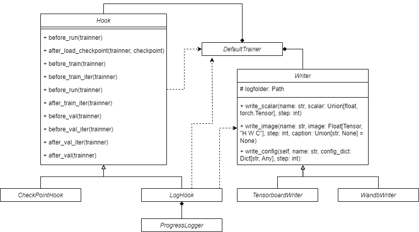

# Hook

Hook module can be used as a tool class to take some actions to Trainer in some fixed time point. the CheckPointHook and LogHook are two example Hook derived from base class, which are used to save the checkpoint during the training loop and to log the training and validation losses, respectively.



LogHook relies on a Console object named Logger to print some log information in the terminal, a ProgressLogger object to visualize the training progress. And it will call the trainer's writer to record log information during in indicated timepoint.

For a writer binded with trainer, it should be inherited from base class `Writer`, and `write_scalar()`, `write_image()` and `write_config()`,  these three abstract functions have to be accomplished. You can create more types of Writer. For instance, TensorboardWriter encapsulates `torch.utils.tensorboard.SummaryWrite` by overriding those three interface functions. You can also indicate the type of writer you want to use in `.yaml`configuration file, conveniently. 

## Where to use

In trainer, the hook function will be called at the specific position:

```{code-block} python
:lineno-start: 1 
:emphasize-lines: "26, 35, 40, 48, 50, 56, 59, 61, 62"
:caption: |
:    We *highlight* the hook part.

class DefaultTrainer:
    """
    The default trainer class for training and testing the model.

    Parameters
    ----------
    cfg : dict
        The configuration dictionary.
    exp_dir : str
        The experiment directory.
    device : str, optional
        The device to use, by default "cuda".
    """
    def __init__(self, cfg: Config, exp_dir: Path, device: str = "cuda") -> None:
        super().__init__()
        self.exp_dir = exp_dir
        self.device = device

        self.start_steps = 1
        self.global_step = 0

        # build config
        self.cfg = parse_structured(self.Config, cfg)
        # build hooks
        self.hooks = parse_hooks(self.cfg.hooks)
        self.call_hook("before_run")
        # build datapipeline
        
        # some code are ignored

    @torch.no_grad()
    def validation(self):
        self.val_dataset_size = len(self.datapipeline.validation_dataset)
        for i in range(0, self.val_dataset_size):
            self.call_hook("before_val_iter")
            batch = self.datapipeline.next_val(i)
            render_dict = self.model(batch)
            render_results = self.renderer.render_batch(render_dict, batch)
            self.metric_dict = self.model.get_metric_dict(render_results, batch)
            self.call_hook("after_val_iter")

    def train_loop(self) -> None:
        """
        The training loop for the model.
        """
        loop_range = range(self.start_steps, self.cfg.max_steps+1)
        self.global_step = self.start_steps
        self.call_hook("before_train")
        for iteration in loop_range:
            self.call_hook("before_train_iter")
            batch = self.datapipeline.next_train(self.global_step)
            self.renderer.update_sh_degree(iteration)
            self.schedulers.step(self.global_step, self.optimizer)
            self.train_step(batch)
            self.optimizer.update_model(**self.optimizer_dict)
            self.call_hook("after_train_iter")
            self.global_step += 1
            if iteration % self.cfg.val_interval == 0 or iteration == self.cfg.max_steps:
                self.call_hook("before_val")
                self.validation()
                self.call_hook("after_val")
        self.call_hook("after_train")

    def call_hook(self, fn_name: str, **kwargs) -> None:
        """
        Call the hook method.

        Parameters
        ----------
        fn_name : str
            The hook method name.
        kwargs : dict
            The keyword arguments.
        """
        for hook in self.hooks:
            # support adding additional custom hook methods
            if hasattr(hook, fn_name):
                try:
                    getattr(hook, fn_name)(self, **kwargs)
                except TypeError as e:
                    raise TypeError(f'{e} in {hook}') from None
```

## More Types of Hook

You can **modify trainer progress by define hook function**, for example, if you want log something after train iteration:

```{note}
The trainer can be fully accessed in the hook function.
We provide log hook and checkpoint hook by default.

@HOOK_REGISTRY.register()
class LogHook(Hook):
    """
    A hook to log the training and validation losses.
    """

    def __init__(self):
        self.ema_loss_for_log = 0.
        self.bar_info = {}
        
        self.losses_test = {"L1_loss": 0., "psnr": 0., "ssims": 0., "lpips": 0.}

    def after_train_iter(self, trainner) -> None:
        """
        some operations after the training iteration ends.

        Parameters
        ----------
        trainner : Trainer
            The trainer object.
        """
        for param_group in trainner.optimizer.param_groups:
            name = param_group['name']
            if name == "point_cloud." + "position":
                pos_lr = param_group['lr']
                break

        log_dict = {
            "num_pt": len(trainner.model.point_cloud),
            "pos_lr": pos_lr
        }
        log_dict.update(trainner.loss_dict)

        for key, value in log_dict.items():
            if key == 'loss':
                self.ema_loss_for_log = 0.4 * value.item() + 0.6 * self.ema_loss_for_log
                self.bar_info.update(
                    {key: f"{self.ema_loss_for_log:.{7}f}"})

            if trainner.logger and key != "optimizer_params":
                trainner.logger.write_scalar(key, value, trainner.global_step)
```

You can refer to tutorial part or Method part for more examples for hook function.