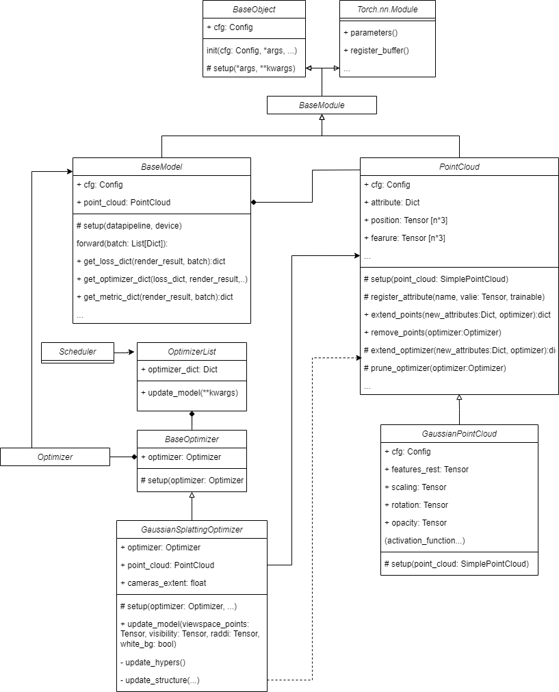

# Model

As shown in the following diagram, the model can be generally divided into **BaseModel**, **PointCloud** and **Optimizer**.


- **BaseModel**: Provides a convenient and flexible way to organize the training process, manage parameters, define computation, and take advantage of PyTorch's automatic differentiation capabilities. It always associates with a PointCloud object, which is the main goal of optimizing. It can also produce the data dictionary used by other modules in this system such as Render and Optimizer.
- **PointCloud**: Provides the function to initialize the point clouds supports flexible definition and rendering of various attributes. Some customized operations on Gaussian Points such as clone, split, remove and reset are supported too, which should be combined with Gaussian Optimizers. You can easily inherit this class to add your own attributes of points as shown in example `GaussianPointCloud`.
- **Optimizer**: Responsible for updating not only the parameters, but also the structures of the model automatically. For instance, it can adjust the number, position, and size of point clouds. 

Here is the class diagram:



## Base model

BaseModel class composites with a PointCloud object. It can also produce the data dictionary that will be used by other modules in this system such as Render and Optimizer. The base model includes the following interfaces that need to be defined:

```{note}
You can refer to the API part for more details of BaseModel.
Only little part need to be modified if you want add your model in Pointrix.
Tutorial illustrates how to add your own model in Pointrix.
@MODEL_REGISTRY.register()
class BaseModel(BaseModule):
    """
    Base class for all models.

    Parameters
    ----------
    cfg : Optional[Union[dict, DictConfig]]
        The configuration dictionary.
    datapipeline : BaseDataPipeline
        The data pipeline which is used to initialize the point cloud.
    device : str, optional
        The device to use, by default "cuda".
    """
    @dataclass
    class Config:
        point_cloud: dict = field(default_factory=dict)
        lambda_dssim: float = 0.2

    cfg: Config

    def setup(self, datapipeline, device="cuda"):
        self.point_cloud = parse_point_cloud(self.cfg.point_cloud,
                                             datapipeline).to(device)
        self.point_cloud.set_prefix_name("point_cloud")
        self.device = device

    def forward(self, batch=None) -> dict:
        """
        Forward pass of the model.

        Parameters
        ----------
        batch : dict
            The batch of data.
        
        Returns
        -------
        dict
            The render results which will be the input of renderers.
        """

    def get_loss_dict(self, render_results, batch) -> dict:
        """
        Get the loss dictionary.

        Parameters
        ----------
        render_results : dict
            The render results which is the output of the renderer.
        batch : dict
            The batch of data which contains the ground truth images.
        
        Returns
        -------
        dict
            The loss dictionary which contain loss for backpropagation.
        """

    def get_optimizer_dict(self, loss_dict, render_results, white_bg) -> dict:
        """
        Get the optimizer dictionary which will be 
        the input of the optimizer update model

        Parameters
        ----------
        loss_dict : dict
            The loss dictionary.
        render_results : dict
            The render results which is the output of the renderer.
        white_bg : bool
            The white background flag.
        """

    @torch.no_grad()
    def get_metric_dict(self, render_results, batch) -> dict:
        """
        Get the metric dictionary.

        Parameters
        ----------
        render_results : dict
            The render results which is the output of the renderer.
        batch : dict
            The batch of data which contains the ground truth images.
        
        Returns
        -------
        dict
            The metric dictionary which contains the metrics for evaluation.
        """
    
    def load_ply(self, path):
        """
        Load the ply model for point cloud.

        Parameters
        ----------
        path : str
            The path of the ply file.
        """

```

**It you want to create your personal way to calculate loss or the input of render and so on, you can just inherit this class.**

Because it is derived from Torch.nn.Module, the system can easily get model's parameters including all trainable attributes of PointCloud, by using `model.parameters()`. These parameters will be offered to construct Optimizer.

## Point Cloud

### PointCloud 

We have defined a PointCloud class that supports flexible definition and rendering of various attributes. For example, if you wish to add depth as an attribute to the point cloud, you can do so as follows:

```python
point_cloud = PointsCloud(cfg)
point_cloud.register_atribute('depth', depth)
```

It is accomplished by maintain a variable named `attributes` which is a list of Dictionary, each Dictionary has `name` to get the attribute's name and `trinable` to indicate whether this attribute's gradient should be calculated. 

```python
def register_atribute(self, name:str, value:Float[Tensor, "3 1"], trainable=True) -> None:
        self.register_buffer(name, value)
        if self.cfg.trainable and trainable:
            setattr(
                self, 
                name, 
                nn.Parameter(
                    value.contiguous().requires_grad_(True)
                )
            )
        self.atributes.append({
            'name': name,
            'trainable': trainable,
        })
```

PointCloud also provides API`save_ply(path:Path)`and `load_ply(path:Path)` to help to save/load the customized point cloud to `.ply` file.

### GaussianPointCloud 

Based on Point Cloud, we further define the GaussianPointCloud Class, which contains  `position`, `feature`, `feature_rest`, `opacity`, `scale` by default. The following code shows how GaussianPointCloud set up:

```python
def setup(self, point_cloud=None):
        super().setup(point_cloud)
        # Activation funcitons
        self.scaling_activation = torch.exp
        self.scaling_inverse_activation = torch.log
        self.covariance_activation = build_covariance_from_scaling_rotation
        self.opacity_activation = torch.sigmoid
        self.inverse_opacity_activation = inverse_sigmoid
        self.rotation_activation = torch.nn.functional.normalize

        scales, rots, opacities, features_rest = gaussian_point_init(
            position=self.position,
            max_sh_degree=self.cfg.max_sh_degree,
        )

        fused_color = self.features.unsqueeze(1)
        self.features = (
            nn.Parameter(
                fused_color.contiguous().requires_grad_(True)
            )
        )
        self.register_atribute("features_rest", features_rest)
        self.register_atribute("scaling", scales)
        self.register_atribute("rotation", rots)
        self.register_atribute("opacity", opacities)
```

And we also define some customized operations on Gaussian Points such as clone, split, remove and reset, which should be combined with Gaussian Optimizers, which will be discussed in the following part. **You can follow this example to create your own type of points.**

## Optimizer

### BaseOptimizer

An optimizer is a component responsible for executing parameter updates through gradient descent in a model. Pointrix further encapsulates optimizers at the level of PyTorch optimizers. Specifically, Pointrix's optimizer composites a PyTorch Optimizer to help for updating parameters.

### GaussianSplattingOptimizer 

Compared to optimizers that only update model parameters, we propose **Gaussian Optimizers**. As depicted in the diagram above, these optimizers not only update model parameters but also adjust the number, position, and size of point clouds. 

For instance, GaussianSplattingOptimizer has a function to execute updates:

```python
def update_model(self, viewspace_points: Tensor,
                     visibility: Tensor, radii: Tensor, white_bg: bool, **kwargs) -> None:
        with torch.no_grad():
            viewspace_grad = self.accumulate_viewspace_grad(viewspace_points)
            self.update_structure(visibility, viewspace_grad, radii, white_bg)
            self.update_hypers()
            self.optimizer.step()
            self.optimizer.zero_grad(set_to_none=True)
```

In this piece of code you can see the update process can be divided into 4 steps. 

1. Update structures based on  the hyper-parameters and the gradients of the parameters, if this iteration follow the requirement determined by hypers.
2. Update hyper-parameters as training goes on.
3. Execution gradient descent.
4. Clear gradient.

If the structure of parameters need to be modified by the customized Optimizer. The PyTorch optimizer associated it should also be updates such as modifying the length of the parameters Tensor.

Pointrix's point have supported structure modification already. Specifically, the PointCloud interfaces related to structure updates such as `replace(self, new_atributes:dict, optimizer:Union[Optimizer, None]=None)`, `extend_points(...)` and `remove_points(...)`have a PyTorch optimizer as a formal parameter. Not only the PointCloud itself should be updated, but the PyTorch optimizer's shape of parameters should also be updated when the structure is modified. Here is the detail of how to remove some points from model, other types of operations are similar:

```
def remove_points(self, mask:Tensor, optimizer:Union[Optimizer, None]=None) -> None:
        """
        remove points of the point cloud with mask.
        
        Parameters
        ----------
        mask: Tensor
            The mask for removing the points.
        """
        if optimizer is not None:
            prune_tensor = self.prune_optimizer(
                mask, 
                optimizer
            )
            for key, value in prune_tensor.items():
                setattr(self, key, value)
        else:
            for atribute in self.atributes:
                name = atribute['name']
                prune_value = nn.Parameter(
                    getattr(
                        self, name
                    )[mask].contiguous().requires_grad_(True)
                )
                setattr(self, key, prune_value)
    
    def prune_optimizer(self, mask:Tensor, optimizer:Union[Optimizer, None])->None:
        """
        prune the point cloud in optimizer with mask.
        
        Parameters
        ----------
        mask: Tensor
            The mask for removing the points.
        optimizer: Optimizer
            The optimizer for the point cloud.
        """
        optimizable_tensors = {}
        for group in optimizer.param_groups:
            if self.prefix_name in group["name"]:
                unwarp_ground = self.unwarp(group["name"])
                stored_state = optimizer.state.get(group['params'][0], None)
                if stored_state is not None:
                    stored_state["exp_avg"] = stored_state["exp_avg"][mask]
                    stored_state["exp_avg_sq"] = stored_state["exp_avg_sq"][mask]

                    del optimizer.state[group['params'][0]]
                    group["params"][0] = nn.Parameter(
                        (group["params"][0][mask].contiguous().requires_grad_(True))
                    )
                    optimizer.state[group['params'][0]] = stored_state

                    optimizable_tensors[unwarp_ground] = group["params"][0]
                else:
                    group["params"][0] = nn.Parameter(
                        group["params"][0][mask].contiguous().requires_grad_(True)
                    )
                    optimizable_tensors[unwarp_ground] = group["params"][0]
        return optimizable_tensors
```

If you have your own way to take charge of structure updates, **you can just inherit GaussianSplattingOptimizer, or define your own optimizer inherited from BaseOptimizer.**

### Scheduler

- Scheduler can help you update the hyper-parameters such as learning rate as training goes on.

- You can define your own scheduler.

Here is the example of learning rate scheduler, you can use it in trainer by calling `step(step:int,optimizers:OptimizerList)`

```Python
def step(self, global_step: int, optimizer_list: OptimizerList) -> None:
        """
        Update the learning rate for the optimizer.

        Parameters
        ----------
        global_step : int
            The global step in training.
        optimizer_list : OptimizerList
            The list of all the optimizers which need to be updated.
        """
        for param_group in optimizer_list.param_groups:
                name = param_group['name']
                if name in self.scheduler_funcs.keys():
                    lr = self.scheduler_funcs[name](global_step)
                    param_group['lr'] = lr
```

